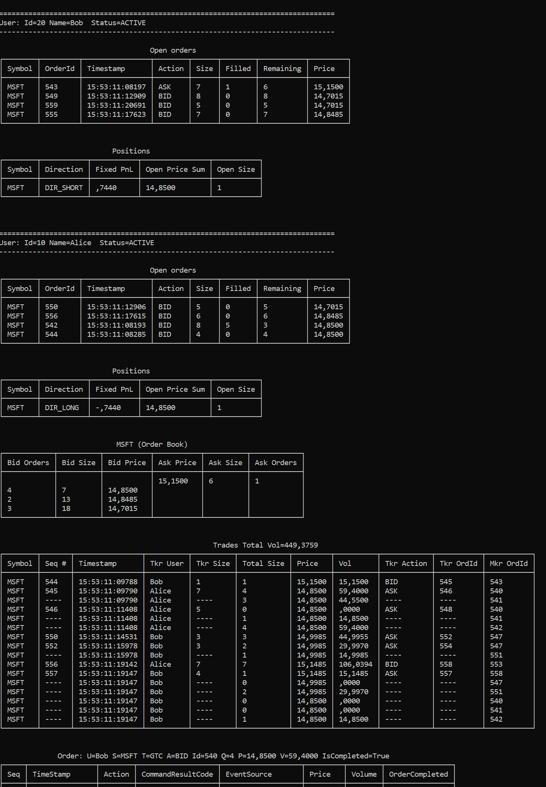

# vertr

## Exchange Emulator Engine 

### Inspired by

- [exchange-core](https://github.com/exchange-core/exchange-core)
- [LMAX Disruptor](https://github.com/LMAX-Exchange/disruptor)
- [Aeron](https://github.com/real-logic/aeron)


### Sample

```csharp
public class Program
{
    private const string _terminalHostUrl = "http://localhost:5010";

    public static async Task Main()
    {
        var trading = new RandomWalkTrading(
            _terminalHostUrl,
            basePrice: 10.45m,
            numberOfIterations: 10);

        await trading.Execute();
    }
}

public class RandomWalkTrading(string terminalHostUrl, decimal basePrice, int numberOfIterations) 
    : TradingBase(terminalHostUrl, Symbols.MSFT)
{
    private readonly decimal _basePrice = basePrice;
    private readonly int _numberOfIterations = numberOfIterations;

    protected override async Task StartTrading()
    {
        var t1 = Task.Run(async () =>
        {
            await Commands.RandomWalk(Users.Bob, Symbol, _basePrice, _numberOfIterations);
        });

        var t2 = Task.Run(async () =>
        {
            await Commands.RandomWalk(Users.Alice, Symbol, _basePrice, _numberOfIterations);
        });

        await Task.WhenAll(t1, t2);

        await DumpResults();
    }

    ...
```





